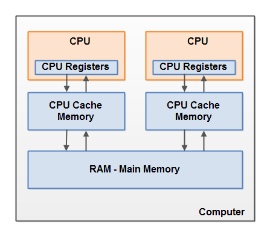

# Java Multithreading & Concurrency Notes
02<sup>nd</sup> Feb 2025

|| ॐ साई राम ||

## Intro

**Benefits of Multithreading**

- Better CPU utilization.
- Simpler program design in some situations.
- More responsive programs.
- More fair division of CPU resources between different tasks.

> More explanation here -> [Jenkov Blog](https://jenkov.com/tutorials/java-concurrency/benefits.html).

**Cons of Multithreading**

- More complex design _(More synchronization required)_.
- Context switching overhead _(CPU switching from one thread to another)_.
- Increased resource consumption _(memory consumption more)._

> More explanation here -> [Jenkov Blog](https://jenkov.com/tutorials/java-concurrency/costs.html).

**Concurrency Models**

- Parallel Workers _(Incoming jobs are assigned to different workers. )_
    - Shared State Workers
    - Stateless Workers
- Assembly Line _(Reactive/ Event Driven Systems)_
- Functional Parallelism _(you implement your program using function calls)_

> More Explanation -> [Jenkov Blog](https://jenkov.com/tutorials/java-concurrency/concurrency-models.html)

**Race Conditions**

Race conditions occur when two or more threads try to access a **_critical section_** of code (read data members) and their sequence of accessing the critical section makes a difference in the final result. 

There are two types of race condition patterns - 

1. Read-Modify-Write
2. Check-Then-Act

> To prevent the race conditions, we have to use synchronized blocks. 

**Thread Safety**

Code that is safe to call by multiple threads is called _Thread safe code_.

- Primitive Local variables
- Local object references (Only the object reference and not the object itself. Object is stored in heap)
- Object Member Variables

> If a resource is created, used and disposed within
the control of the same thread,
and never escapes the control of this thread,
the use of that resource is thread safe.

Race conditions occur only if multiple threads are **writing** to the same resource.
It does not occur if multiple threads are just **reading** the same resource. 

We can create the shared objects between threads as immutable to achieve thread safety.

**Java Memory Model**

In java memory model, the different entities are stored at different locations -

- It can be stored in thread stack memory.
- It can be stored in heap memory.

| Entity | Location where it is stored |
|--------|-----------------------------|
| Local Variable (Primitive) | Thread Stack |
| Local Variable Reference (which is pointing to some object)| Thread Stack |
| Local Variable Object (which some reference is pointing to)| Heap Memory |
| Any Object | Heap Memory |
| Object Member Variables (Even if primitive types) | Heap Memory |
| Object Member Variables (Reference to another Object) | Heap Memory |
| Static class variables | Heap Memory |
| Static Class Definition | Heap Memory |

**Hardware Memory**



There are 3 components - 
- CPU -> Can have multiple cores and can run more than one thread at a time. 
- CPU Registers -> CPU can read/write from here the fastest.
- CPU cache memory -> CPU  can read/write from here but slower than CPU registers.
- RAM (Main Memory) -> Objects are read from here.  Comparatively the slowest to read/write to for the CPU. 

As the memory is read from cache, main and registers, the objects are scattered across the memory model. There needs to be synchronization between various threads while reading/writing back objects to main memory. 

>  Parts of the thread stacks and heap may sometimes be present in CPU caches and in internal CPU registers.

Because objects and variables are scattered across different parts of the memory, following problems may occur ->
- Visibility of thread updates (writes) to shared variables.
- Race conditions when reading, checking and writing shared variables.

**Synchronized keyword**

- A synchronized block in Java is synchronized on some object. All synchronized blocks synchronized on the same object can only have one thread executing inside them at the same time.
- All other threads attempting to enter the synchronized block are blocked until the thread inside the synchronized block exits the block.
- The synchronized keyword can be used to mark four different types of blocks:
    - **Instance methods** : A synchronized instance method in Java is synchronized on the instance (object) owning the method

        ```java
        public class MyCounter {
                private int count = 0;
                public synchronized void add(int value){
                    this.count += value;
                }
        }
        ```
    - Static methods

        ```java
        public static MyStaticCounter{
                private static int count = 0;
                public static synchronized void add(int value){
                count += value;
            }
        }
        ```
    - Code blocks inside instance methods
    - Code blocks inside static methods

## Inter-thread communication

Also called Inter-thread **signalling**. Carried out by following methods present in object class - 
- wait()
- notify()
- notifyAll()

