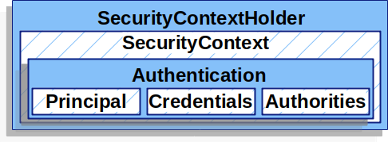

# Spring Security
5th Match 2025

Detailed notes for in-depth revision. 

### Agenda

1. What is Spring Security?
1. Spring security basic working.
1. Complete comprehensive understanding of Spring Security Architecture.
1. All the important classes and interfaces along with their functions.
1. Hands-on Spring security implementation in a spring boot project for following use cases - 
    
    - Basic authentication [[Official Docs Link](https://docs.spring.io/spring-security/reference/servlet/authentication/passwords/basic.html)]
    - Username/ Password authentication with password stored in database.
    - Authentication using JWT Token
    - Authentication using OAuth2
---

### What is Spring Security?
1. **De-facto standard** for securing Spring Applications.
1. **Framework** which provides **Authentication, Authorization and Protection against common attacks.**

### Spring Security Filters

1. **SecurityContextPersistenceFilter** : Loads SecurityContext from Session/Other mechanisms. | **Runs for every request**
1. **HeaderWriterFilter** : Adds security related headers to response like X-Content-type-Options, X-XSS-Protetion etc.
1. **CSRFfilter** : Protects against CSRF attacks.
1. **UserNamePasswordAuthenticationFilter** : Processes authentication requests when user logs in using username and password.
1. **BasicAuthenticationFilter** : Checks the basic authentication headers coming into incoming requests and authenticates the user accordingly. 
1. **RequestCacheAwareFilter** : Works along with `ExceptionTranslationFilter` to remember the original authentication request which failed and redirects user to the original request once succeeded. 
1. **ExceptionTranslationFilter** : Handles the exceptions thrown by the framework such as AuthenticationException and decides how to respond.
1. **FilterSecurityInterceptor** : This is the **last** filter to run in the security filter chain. It checks every request and sees if the authenticated user has the required access or not. 

>Not all the filters are run for every request. It depends upon the kind of request you are sending to the application and the configuration you have setp in your Spring Security config. 

### What is SecurityContextHolder ?

It is the heart of Spring Security. It has the user details of who is authenticated. 
It has -

- Security Context 
    
    - Authentication

        - Principal
        - Credentials
        - Authorities
        

